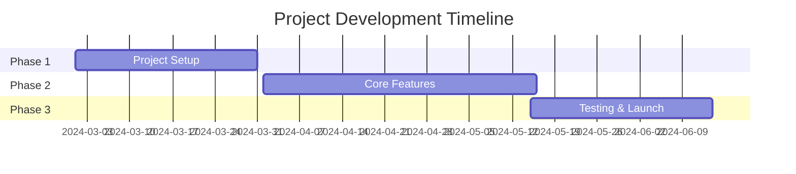

# ⏰ Learning Management System

<div align="center">

[](VERSION)
[](LICENSE)
[](CHANGELOG.md)
[](https://github.com/KOSALSENSOK096)


### ⏱️ Time-Focused Learning Platform

[Live Demo](https://your-demo-link.com) • [Report Bug](https://github.com/KOSALSENSOK096/learning-managment-system/issues) • [Request Feature](https://github.com/KOSALSENSOK096/learning-managment-system/issues)

</div>

## 🕐 Features Timeline

<div align="center">
<table>
<tr>
<td align="center" width="25%">
<h3>🕒 9:00</h3>
<b>Morning Classes</b>
<br/>
Live streaming lectures
</td>
<td align="center" width="25%">
<h3>🕐 12:00</h3>
<b>Assignments</b>
<br/>
Interactive exercises
</td>
<td align="center" width="25%">
<h3>🕓 3:00</h3>
<b>Study Groups</b>
<br/>
Collaborative learning
</td>
<td align="center" width="25%">
<h3>🕕 6:00</h3>
<b>Review Time</b>
<br/>
Progress tracking
</td>
</tr>
</table>
</div>

## ⏲️ Real-time Features

<div align="center">
<table>
<tr>
<td align="center" width="33%">
<h2>⌚</h2>
<b>Time Management</b>
<br/>
Smart scheduling system
</td>
<td align="center" width="33%">
<h2>⏰</h2>
<b>Reminders</b>
<br/>
Never miss a deadline
</td>
<td align="center" width="33%">
<h2>🕰️</h2>
<b>Progress Tracking</b>
<br/>
Real-time analytics
</td>
</tr>
</table>
</div>

## 📊 Learning Progress

<div align="center">

| Time Period | Completion Rate |
|------------|----------------|
| 🌅 Morning |  |
| 🌞 Afternoon |  |
| 🌃 Evening |  |

</div>

## 🚀 Quick Start

```bash
# Clone repository
git clone https://github.com/KOSALSENSOK096/learning-managment-system.git

# Enter directory
cd learning-managment-system

# Install dependencies
npm install

# Start development server
npm run dev
```

## 🕓 Upcoming Features

- ⏰ AI-powered scheduling
- ⌚ Cross-timezone collaboration
- 🕐 Smart attendance tracking
- 🕒 Automated time management
- ⏲️ Real-time progress updates

## 👨‍💻 Developer

<div align="center">

<h3>KOSAL SENSOK</h3>
<p>⏰ Time Management Expert | 🎓 Educational Technology Enthusiast</p>

[](https://github.com/KOSALSENSOK096)
[](https://www.youtube.com/@SokCodeing)
[](https://t.me/kosalsensok06)

</div>

## ⏱️ Project Timeline

<div align="center">



</div>

## 📈 Activity Clock

<div align="center">


</div>

---

<div align="center">

### ⭐ Star History

[](https://star-history.com/#KOSALSENSOK096/learning-managment-system&Date)

<br/>

<h3>Made with ⏰ by <a href="https://github.com/KOSALSENSOK096">KOSAL SENSOK</a></h3>

⭐ Don't forget to star this repository if you find it helpful!

</div>
