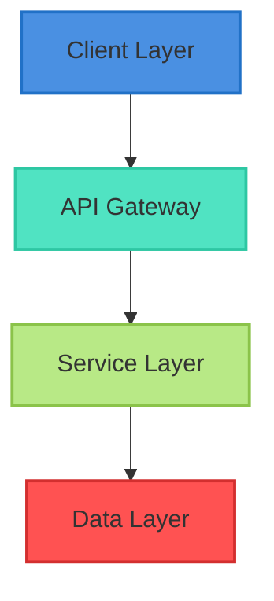
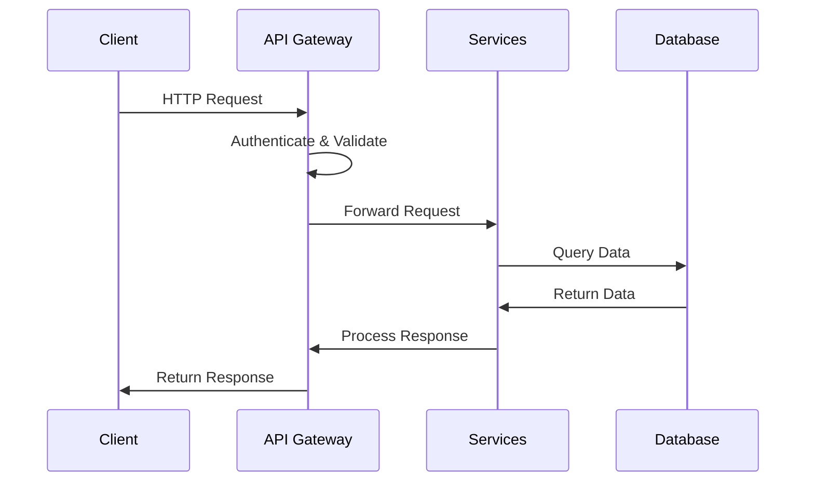
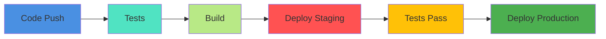

# 🏗️ System Architecture

## 📋 Table of Contents
- [Overview](#overview)
- [System Components](#system-components)
- [Technology Stack](#technology-stack)
- [Data Flow](#data-flow)
- [Security Architecture](#security-architecture)

## 🌐 Overview

The University LMS is built on a modern, scalable architecture following microservices principles and clean architecture patterns.



## 🔧 System Components

### 1. Frontend Layer
- Vue.js SPA Application
- TailwindCSS for styling
- Progressive Web App (PWA)
- Real-time WebSocket connections

### 2. API Gateway
- Laravel API Gateway
- JWT Authentication
- Rate Limiting
- Request Validation

### 3. Service Layer
- Course Management Service
- User Management Service
- Assessment Service
- Notification Service
- Analytics Service

### 4. Data Layer
- MySQL Database
- Redis Cache
- File Storage (S3)
- Search Engine (Elasticsearch)

## 🛠️ Technology Stack

### Frontend Technologies
```json
{
    "framework": "Vue.js 2.6",
    "styling": "TailwindCSS 3.0",
    "state-management": "Vuex",
    "routing": "Vue Router",
    "real-time": "Laravel Echo",
    "ui-components": "Material Design"
}
```

### Backend Technologies
```json
{
    "framework": "Laravel 8.x",
    "php-version": "^7.4|^8.0",
    "database": "MySQL 8.0",
    "caching": "Redis",
    "search": "Elasticsearch",
    "queue": "Laravel Horizon"
}
```

## 🔄 Data Flow



## 🔒 Security Architecture

### Authentication Flow
1. JWT-based authentication
2. OAuth2 integration
3. Two-factor authentication
4. Session management

### Data Security
1. End-to-end encryption
2. At-rest encryption
3. SSL/TLS communication
4. Regular security audits

### Access Control
1. Role-based access control (RBAC)
2. Permission-based actions
3. API scope limitations
4. Resource-level permissions

## 📈 Scalability

### Horizontal Scaling
- Load balancing
- Service replication
- Database sharding
- Cache distribution

### Vertical Scaling
- Resource optimization
- Query optimization
- Caching strategies
- Background processing

## 🔍 Monitoring

### System Metrics
- Server health
- API performance
- Database performance
- Cache hit rates

### Application Metrics
- User engagement
- Error rates
- Response times
- Resource usage

## 🚀 Deployment

### CI/CD Pipeline


### Environment Setup
1. Development
2. Testing
3. Staging
4. Production

## 📊 Performance

### Optimization Strategies
- Code minification
- Asset compression
- Lazy loading
- Cache strategies

### Monitoring Tools
- New Relic
- Laravel Telescope
- Elasticsearch APM
- Custom metrics 